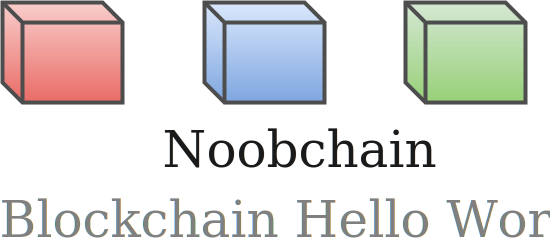
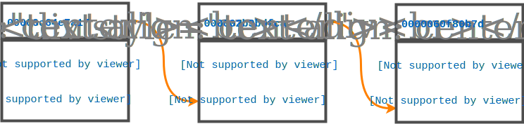
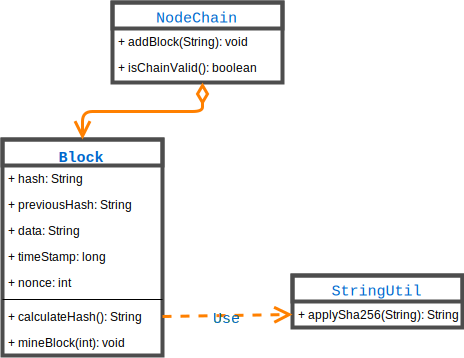

[![Build Status][travis-badge]][travis-badge-url]
[![Quality Gate][sonarqube-badge]][sonarqube-badge-url] 
[![Technical debt ratio][technical-debt-ratio-badge]][technical-debt-ratio-badge-url] 
[![Coverage][coverage-badge]][coverage-badge-url]



Blockchain Noobchain Example
==================================
The noobchain examples are based on the following blogs:

1. [Creating Your First Blockchain with Java. Part 1](https://medium.com/programmers-blockchain/create-simple-blockchain-java-tutorial-from-scratch-6eeed3cb03fa)

1. [Creating Your First Blockchain with Java. Part 2 — Transactions.](https://medium.com/programmers-blockchain/creating-your-first-blockchain-with-java-part-2-transactions-2cdac335e0ce)


Blockchain Glossary
=======================

A **blockchain** is a chain/list of blocks where:
 - Every block contains a hash (digital signature) of the previous block. 
 - A block hash is computed from the hash of its previous block.
 - Each block is guaranteed to come after the previous block chronologically 
 since a block's hash is based on the previous block's hash.
 
A block in a blockchain is computationally impractical to modify since every 
block after it has to be regenerated.

A **genesis block** is the first block of a blockchain.

**Proof of Work (POW)** is a way of ensuring that a new block is difficult to build by
making the block creation process costly and time consuming. However it must be 
relatively trivial to check if a blockchain satifies these requriiments. This 
helps to avoid blockchain tampering.

**Hashcash** is the **Proof of Work** used by Bitcoin. 

Noobchain Example 1
====================



Noobchain example includes the following:

- A simple block (`Block.java`) containing `previous block's hash`, its own 
`hash`, and simple `data`.

```java
public String calculateHash() {
    String calculatedhash = StringUtil.applySha256(
        previousHash +
        Long.toString(timeStamp) +
        Integer.toString(nonce) +
        data);

    return calculatedhash;
}
```

- The `hash` is generated using `SHA-256` cryptograhic hash algorithm. The code
can be found in `StringUtil.java`.

- A blockchain, `NoobChain.java`, built with the aforementioned blocks.

- The first block is called the `genesis block`. The previous hash of the 
 genesis block is defaulted to `0`.

- Checking the `validity` of the `noobchain` by iterating over all the blocks and
comparing the current block hash with the calculated hash. It also checks the 
current block's reference to the previous block hash with the previous block hash.
Any tampering of a block's hash is easily detected.

```java
public Boolean isChainValid() {
    // loop through blockchain to check hashes
    for (int i = 1; i < blockchain.size(); i++) {
        Block currentBlock = blockchain.get(i);
        Block previousBlock = blockchain.get(i - 1);

        // compare current block's hash with calculated hash
        if (!currentBlock.getHash().equals(currentBlock.calculateHash())) {
            log.info("Calculated hash doesn't match block's hash.");
            return false;
        }

        // compare previous hash with current block's previous hash
        if (!previousBlock.getHash().equals(currentBlock.getPreviousHash())) {
            log.info(
                "Previous block hash doesn't match curent block's previous hash.");
            return false;
        }
    }
    return true;
}
```

- The `Proof of Work` in this example is measured by having a certain number of 
`0s` at the beginning of the `hash`. This is done by introducing a `nonce` 
(number used once) in the hash claculation. The `nonce` is modified until the 
required result is achieved. You can find the code in the `mineBlock` method
of `Block` class. The `mineBlock` takes a parameter named `difficulty` which
specifies the number of starting `0s` required for a hash.

```java
public void mineBlock(int difficulty) {
   //Create a string with difficulty * "0"
   String target = new String(new char[difficulty]).replace('\0', '0');

   while (!hash.substring(0, difficulty).equals(target)) {
       nonce++;
       hash = calculateHash();
   }
}
```



Noobchain Example 2
====================


### Build
To build the JAR, execute the following command from the parent directory:

```
mvn clean install
```

### Usage

 
[travis-badge]: https://travis-ci.org/indrabasak/blockchain-noobchain.svg?branch=master
[travis-badge-url]: https://travis-ci.org/indrabasak/blockchain-noobchain/

[sonarqube-badge]: https://sonarcloud.io/api/badges/gate?key=com.basaki:blockchain-noobchain
[sonarqube-badge-url]: https://sonarcloud.io/dashboard/index/com.basaki:blockchain-noobchain 

[technical-debt-ratio-badge]: https://sonarcloud.io/api/badges/measure?key=com.basaki:blockchain-noobchain&metric=sqale_debt_ratio
[technical-debt-ratio-badge-url]: https://sonarcloud.io/dashboard/index/com.basaki:blockchain-noobchain

[coverage-badge]: https://sonarcloud.io/api/badges/measure?key=com.basaki:blockchain-noobchain&metric=coverage
[coverage-badge-url]: https://sonarcloud.io/dashboard/index/com.basaki:blockchain-noobchain
