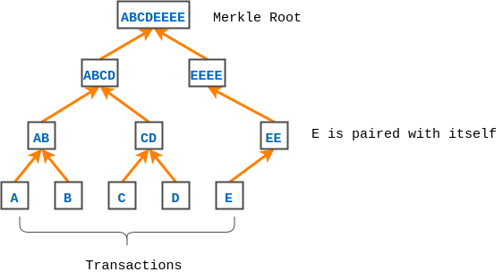

[![Build Status][travis-badge]][travis-badge-url]
[![Quality Gate][sonarqube-badge]][sonarqube-badge-url] 
[![Technical debt ratio][technical-debt-ratio-badge]][technical-debt-ratio-badge-url] 
[![Coverage][coverage-badge]][coverage-badge-url]


Blockchain Noobchain Example
==================================
The noobchain examples are based on the following blogs:

1. [Creating Your First Blockchain with Java. Part 1](https://medium.com/programmers-blockchain/create-simple-blockchain-java-tutorial-from-scratch-6eeed3cb03fa)

1. [Creating Your First Blockchain with Java. Part 2 — Transactions.](https://medium.com/programmers-blockchain/creating-your-first-blockchain-with-java-part-2-transactions-2cdac335e0ce)


Blockchain Glossary
=======================

A **blockchain** is a chain/list of blocks where:
 - Every block contains a hash (digital signature) of the previous block. 
 - A block hash is computed from the hash of its previous block.
 - Each block is guaranteed to come after the previous block chronologically 
 since a block's hash is based on the previous block's hash.
 
A block in a blockchain is computationally impractical to modify since every 
block after it has to be regenerated.

A **genesis block** is the first block of a blockchain.

**Proof of Work (POW)** is a way of ensuring that a new block is difficult to build by
making the block creation process costly and time consuming. However it must be 
relatively trivial to check if a blockchain satifies these requriiments. This 
helps to avoid blockchain tampering.

**Hashcash** is the **Proof of Work** used by Bitcoin. 

A blockchain **wallet** is a digital wallet that allows users to 
manage crypto-currencies such as bitcoin. Coin ownership in a blockchain is 
transferred as transactions. Every participant in a blockchain has a unique
address for sending and receiving crypto-currencies.
 
A **Merkle Tree** is a hash tree where every leaf node is labelled with the
hash of a data block and every non-leaf node is labelled with the cryptographic
hash of the labels of its child nodes. The root node is called the **Merkle
Root** which is labelled with the hash of all its child nodes.

Merkle Tree is an efficient way of verifying large data structures or lot of
 transactions in the case of a blockchain. 
 
A Merkle Tree in blockchain is constructed by hashing paired data (the leaves), 
 then pairing and hashing the results until a single hash remains. The
  remaining single hash is called the **Merkle Root**.



Noobchain Example 1
====================


Noobchain example one includes the following:

- A simple block (`Block.java`) containing `previous block's hash`, its own 
`hash`, and simple `data`.

```java
public String calculateHash() {
    String calculatedhash = StringUtil.applySha256(
        previousHash +
        Long.toString(timeStamp) +
        Integer.toString(nonce) +
        data);

    return calculatedhash;
}
```

- The `hash` is generated using `SHA-256` cryptograhic hash algorithm. The code
can be found in `StringUtil.java`.

- A blockchain, `NoobChain.java`, built with the aforementioned blocks.

- The first block is called the `genesis block`. The previous hash of the 
 genesis block is defaulted to `0`.

- Checking the `validity` of the `noobchain` by iterating over all the blocks and
comparing the current block hash with the calculated hash. It also checks the 
current block's reference to the previous block hash with the previous block hash.
Any tampering of a block's hash is easily detected.

```java
public Boolean isChainValid() {
    // loop through blockchain to check hashes
    for (int i = 1; i < blockchain.size(); i++) {
        Block currentBlock = blockchain.get(i);
        Block previousBlock = blockchain.get(i - 1);

        // compare current block's hash with calculated hash
        if (!currentBlock.getHash().equals(currentBlock.calculateHash())) {
            log.info("Calculated hash doesn't match block's hash.");
            return false;
        }

        // compare previous hash with current block's previous hash
        if (!previousBlock.getHash().equals(currentBlock.getPreviousHash())) {
            log.info(
                "Previous block hash doesn't match curent block's previous hash.");
            return false;
        }
    }
    return true;
}
```

- The `Proof of Work` in this example is measured by having a certain number of 
`0s` at the beginning of the `hash`. This is done by introducing a `nonce` 
(number used once) in the hash claculation. The `nonce` is modified until the 
required result is achieved. You can find the code in the `mineBlock` method
of `Block` class. The `mineBlock` takes a parameter named `difficulty` which
specifies the number of starting `0s` required for a hash.

```java
public void mineBlock(int difficulty) {
   //Create a string with difficulty * "0"
   String target = new String(new char[difficulty]).replace('\0', '0');

   while (!hash.substring(0, difficulty).equals(target)) {
       nonce++;
       hash = calculateHash();
   }
}
```


Noobchain Example 2
====================
Noobchain example two includes the following:

- A simple block (`Block.java`) containing `previous block hash`, its own 
`hash`, and list of `transactions`.

- The `hash` is generated using `SHA-256` cryptograhic hash algorithm from
`previous block hash`, `timestamp`, `nonce`, and `Merkle Root` from the
transaction ids.

- A simple `wallet` which can send and receive transactions of `noobcoins`.

- Every `wallet` has a `public key` and a `private key`. The `public key` acts
as the wallet's address. The `private key` is used to `sign transactions`. 
Signing prevents tampering with a owner's `noobcoins`. A sender's `public key` 
is sent along every transaction for verification. The `public key` is used to
verify the integrity.

- A private and public keys are generated as a key pair`. `Elliptic Curve Digital 
Signature Algorithm (ECDSA)` signature is used to generate the key pair in
method `generateKeyPair` of `Wallet` class.

- `Transactions` are sent using `NoobChain`. Each transaction contains the
following information:
  - a unique `transaction id`
  - `public keys` of the sender and the receiver of funds
  - `amount` to be transferred 
  - previous transactions (`inputs`) which helps in proving that there is 
  enough fund to send 
  - outgoing transactions (`outputs`) with the amount to be transferred 
  - a `crytographic signature` to prevent transaction from tampering and also
  prevents unauthorized user to spend noobcoins.

- The following action take place when a sender wallet sends `noobcoins` to 
a receiver wallet:
  1. Checks the balance of the sender wallet by summing up all the unspent
     transaction outputs which having the same public key as the sender wallet.
  1. If the amount being sent is greater than the balance, a transaction is
  created and signed.
  1. The newly created transaction is added to a newly created block and 
  processed.


### Build
To build the JAR, execute the following command from the parent directory:

```
mvn clean install
```

### Usage
Run the  `NoobChain` class for each of the examples from an IDE like IntelliJ.

#### Noobchain Example 1 Output

```bash
Block Mined!!! : 00000dd85c854b8dfdba7b61358d2444d2afd613dbce55317f81a416551a9497
Block Mined!!! : 00000a0ae7bbf378b5643762178656a6a2be3797d08b5b39a550ee7809ea3517
Block Mined!!! : 000004720fe2ccc9b8112aa1b0e6e48412c86c1db41df566bd3b4d72a4801cb7
[
  {
    "hash": "00000dd85c854b8dfdba7b61358d2444d2afd613dbce55317f81a416551a9497",
    "previousHash": "0",
    "data": "Hi I'm the first block",
    "timeStamp": 1523425003386,
    "nonce": 106963
  },
  {
    "hash": "00000a0ae7bbf378b5643762178656a6a2be3797d08b5b39a550ee7809ea3517",
    "previousHash": "00000dd85c854b8dfdba7b61358d2444d2afd613dbce55317f81a416551a9497",
    "data": "Yo I'm the second block",
    "timeStamp": 1523425003789,
    "nonce": 108288
  },
  {
    "hash": "000004720fe2ccc9b8112aa1b0e6e48412c86c1db41df566bd3b4d72a4801cb7",
    "previousHash": "00000a0ae7bbf378b5643762178656a6a2be3797d08b5b39a550ee7809ea3517",
    "data": "Hey I'm the third block",
    "timeStamp": 1523425004150,
    "nonce": 1812067
  }
]
valid block chain: true
```

#### Noobchain Example 2 Output

```bash
2018-04-10T22:35:23.727-07:00: [INFO] main com.basaki.noobchain.NoobChain - Creating and Mining Genesis block... 
2018-04-10T22:35:23.732-07:00: [INFO] main com.basaki.noobchain.Block - Transaction Successfully added to Block
2018-04-10T22:35:23.748-07:00: [INFO] main com.basaki.noobchain.Block - Block Mined!!! : 000dea2b320f1649463bc2e932fe44e3fa0773b54889bd73a38b7382f54e27d9
2018-04-10T22:35:23.798-07:00: [INFO] main com.basaki.noobchain.NoobChain - WalletA's balance is: 100.0
2018-04-10T22:35:23.798-07:00: [INFO] main com.basaki.noobchain.NoobChain - WalletA is Attempting to send funds (40) to WalletB...
2018-04-10T22:35:23.802-07:00: [INFO] main com.basaki.noobchain.Block - Transaction Successfully added to Block
2018-04-10T22:35:23.817-07:00: [INFO] main com.basaki.noobchain.Block - Block Mined!!! : 000a8a6d690c97f2dcb75e1e044706aae90d3b7619be1ef53a17e8522a757371
2018-04-10T22:35:23.817-07:00: [INFO] main com.basaki.noobchain.NoobChain - WalletA's balance is: 60.0
2018-04-10T22:35:23.817-07:00: [INFO] main com.basaki.noobchain.NoobChain - WalletB's balance is: 40.0
2018-04-10T22:35:23.817-07:00: [INFO] main com.basaki.noobchain.NoobChain - WalletA Attempting to send more funds (1000) than it has...
2018-04-10T22:35:23.817-07:00: [INFO] main com.basaki.noobchain.Wallet - Transaction discarded as there isn't enough fund...
2018-04-10T22:35:23.869-07:00: [INFO] main com.basaki.noobchain.Block - Block Mined!!! : 000fbb6ec4e745447405790e4813fc61bc0b41d2bcca5a5d9532ac87fde75835
2018-04-10T22:35:23.869-07:00: [INFO] main com.basaki.noobchain.NoobChain - WalletA's balance is: 60.0
2018-04-10T22:35:23.869-07:00: [INFO] main com.basaki.noobchain.NoobChain - WalletB's balance is: 40.0
2018-04-10T22:35:23.869-07:00: [INFO] main com.basaki.noobchain.NoobChain - WalletB is Attempting to send funds (20) to WalletA...
2018-04-10T22:35:23.872-07:00: [INFO] main com.basaki.noobchain.Block - Transaction Successfully added to Block
2018-04-10T22:35:23.907-07:00: [INFO] main com.basaki.noobchain.Block - Block Mined!!! : 000c9ff1c10a0fc2dfd1bf7ae56d8b3dd744bda52e68657483704738c3a181d2
2018-04-10T22:35:23.907-07:00: [INFO] main com.basaki.noobchain.NoobChain - WalletA's balance is 80.0
2018-04-10T22:35:23.907-07:00: [INFO] main com.basaki.noobchain.NoobChain - WalletB's balance is 20.0
2018-04-10T22:35:23.910-07:00: [INFO] main com.basaki.noobchain.NoobChain - Block Chain Valid: true
```
 
[travis-badge]: https://travis-ci.org/indrabasak/blockchain-noobchain.svg?branch=master
[travis-badge-url]: https://travis-ci.org/indrabasak/blockchain-noobchain/

[sonarqube-badge]: https://sonarcloud.io/api/badges/gate?key=com.basaki:blockchain-noobchain
[sonarqube-badge-url]: https://sonarcloud.io/dashboard/index/com.basaki:blockchain-noobchain 

[technical-debt-ratio-badge]: https://sonarcloud.io/api/badges/measure?key=com.basaki:blockchain-noobchain&metric=sqale_debt_ratio
[technical-debt-ratio-badge-url]: https://sonarcloud.io/dashboard/index/com.basaki:blockchain-noobchain

[coverage-badge]: https://sonarcloud.io/api/badges/measure?key=com.basaki:blockchain-noobchain&metric=coverage
[coverage-badge-url]: https://sonarcloud.io/dashboard/index/com.basaki:blockchain-noobchain
